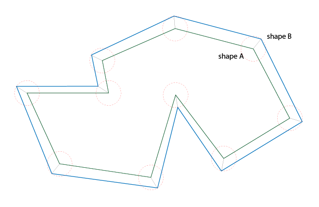

# shape-expand-reduce
**Node.js** package for expading/reducing a shapes


# Installation
```
npm install shape-expand-reduce
```

# How to use
- Import the expand/reduce function with `var ... = require("shape-expand-reduce");`
- Function has will expect 3 arguments (2 optional)
 - **points** is a collection of points in space which describes original shape. Collection items can have 2 formats (
 `Array[number (x), number (y)]` or `Object{x: number, y: number}`). **Given input format will be reused for output.**
 - **factor** *(default 1.0)* is by what amount should the shape be expanded/reduced
 - **absolute** *(default true)* says if *factor* is absolute or relative number **(Still to be implemented)**
- Function will return new Array with transformed points (based on given **points** input format)

# Example
```javascript
// Import module
var expander = require("shape-expand-reduce");

// Create square shape
var squareShape = [
    [0, 0],
    [10, 0],
    [0, 10],
    [0, 0]
];

// Create expanded shape (by 1) from square
var expandedShape = expander(squareShape, 1);
```

# TODO
Last argument is **absolute** and is currently not implemented


